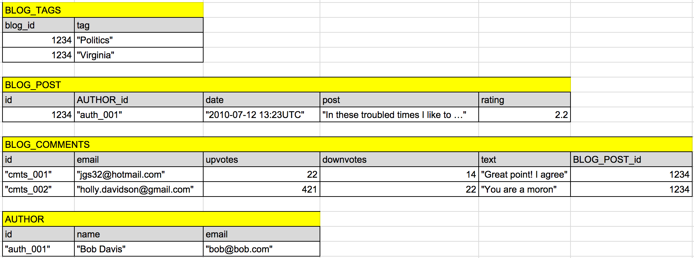
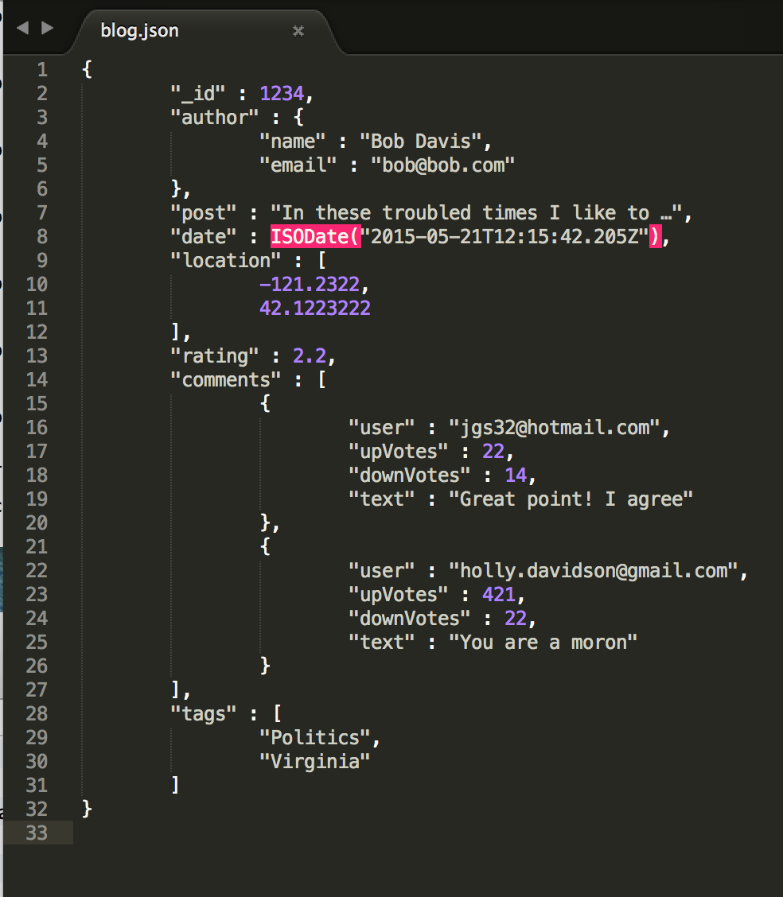

## What is MongoDB  
[MongoDB](http://en.wikipedia.org/wiki/MongoDB) is a cross-platform document-oriented database. Classified as a NoSQL database, MongoDB eschews the traditional table-based relational database structure, in favor of JSON-like documents with dynamic schemas (MongoDB calls the format BSON), making the integration of data in certain types of applications easier and faster. Released under a combination of the GNU Affero General Public License and the Apache License, MongoDB is free and open-source software. MongoDB has been adopted as backend software by a number of major websites and services, including Craigslist, eBay, Foursquare, SourceForge, Viacom, and the New York Times among others. MongoDB is the most popular NoSQL database system.

---

## What is JSON  
[JSON](http://json.org/) (JavaScript Object Notation) is a lightweight data-interchange format. It is easy for humans to read and write. It is easy for machines to parse and generate. It is based on a subset of the JavaScript Programming Language, Standard ECMA-262 3rd Edition - December 1999. JSON is a text format that is completely language independent but uses conventions that are familiar to programmers of the C-family of languages, including C, C++, C#, Java,JavaScript,Perl, Python, and many others. These properties make JSON an ideal data-interchange language.  

---

## JSON consists of 6 data types, they are
- string
- number
- object
- array
- boolean (true, false)
- null
  


---

## JSON vs. XML 

### student.json   

```
{ 
        "_id" : 123,
        "sName" : "Amy", 
        "GPA" : 3.9,
        "sizeHS" : 1000
}
```
### student.xml   

```
<student>
        <id>123</id>
        <sName>Amy</sName>
        <GPA>3.9</GPA>
        <sizeHS>1000</sizeHS>
</student>
```

---

## JSON on the internet  

### Question   
  - What is Spanish alias for Beatles?
  
### Query  
  - [http://musicbrainz.org/ws/2/artist/?query=artist%3ABEATLES&fmt=json](http://musicbrainz.org/ws/2/artist/?query=artist%3ABEATLES&fmt=json)  
  
### Result   
  - Get a JSON document

---

## JSON on the internet  

### Analyse on the document  

```js
artists = doc.artists
artists[0].name = "The Beatles"
artists[1].name = "Counterfeit Beatles"
artists[1].name = "Jolly Joker and the Plastic Beatles of the Universe"
aliases = artists[0].aliases
aliases[0].locale = "ko"
aliases[2].locale = null
aliases[5].locale = "es"
aliases[5] ={
                "begin-date" : null,
                "end-date" : null,
                "locale" : "es",
                "name" : "Los Beatles",
                "primary" : true,
                "sort-name" : "Los Beatles",
                "type" : null
            }
aliases[5].name = "Los Beatles"
```

---

## JSON on the internet  

### Question   
  - What is Spanish alias for Beatles?
  
### Query  
  - [http://musicbrainz.org/ws/2/artist/?query=artist%3ABEATLES&fmt=json](http://musicbrainz.org/ws/2/artist/?query=artist%3ABEATLES&fmt=json)  
  
### Result   
  - Get a JSON document  

### Answer   
  - After analysing the json document, we know that Spanish alias for Beatles is "Los Beatles".

---

## MongoDB vs. SQL

* database <--> database
* table <--> collection
* row <--> document or BSON document
* column <--> field
* index <--> index
* table joins <--> embedded documents and linking
* primary key Specify any unique column or column combination as primary key. <--> primary key. In MongoDB, the primary key is automatically set to the _id field.
* [see more here](http://docs.mongodb.org/manual/reference/sql-comparison/)

---

## MongoDB CRUD operations  

* Create data  
* Read data  
* Update data  
* Destroy data   

---

## Read data 

### findOne & find   

```find
mongo> db
company
mongo> db.colleagues.findOne()
{
        "_id" : 1,
        "name" : "Bob",
        "gender" : "Male"
}
mongo> db.colleagues.find()
{ "_id" : 1, "name" : "Bob", "gender" : "Male" }
{ "_id" : 2, "name" : "Johanne", "gender" : "Female" }
{ "_id" : 3, "name" : "Michael", "gender" : "Male" }
{ "_id" : 4, "name" : "Emily", "gender" : "Female" }
{ "_id" : 5, "name" : "Amy", "gender" : "Female" }
{ "_id" : 6, "name" : "ada", "gender" : "Female" }
```

---

## Update data  
### save & update
```save
mongo> ada = db.colleagues.findOne({_id : 6})
{ "_id" : 6, "name" : "ada", "gender" : "Female" }
mongo> ada.name = "Ada"
Ada
mongo> db.colleagues.save(ada)
WriteResult({ "nMatched" : 1, "nUpserted" : 0, "nModified" : 1 })
mongo> db.colleagues.find({_id : 6})
{ "_id" : 6, "name" : "Ada", "gender" : "Female" }
```

```update
mongo> db.colleagues.findOne({_id : 6})
{ "_id" : 6, "name" : "ada", "gender" : "Female" }
mongo> db.colleagues.update({_id : 6}, {$set : {name : "Ada"}})
WriteResult({ "nMatched" : 1, "nUpserted" : 0, "nModified" : 1 })
mongo> db.colleagues.find({_id : 6})
{ "_id" : 6, "name" : "Ada", "gender" : "Female" }
```

---

## Create data   
### save & insert (collection will be automatically created) 

```create
mongo> show collections
blog
colleagues
system.indexes
mongo> db.students.save({ _id : 123, sName : "Amy", GPA : 3.9})
WriteResult({ "nMatched" : 0, "nUpserted" : 1, "nModified" : 0, "_id" : 123 })
mongo> show collections
blog
colleagues
students
system.indexes
mongo> db.students.insert({ sName : "Bob", GPA : 3.4})
WriteResult({ "nInserted" : 1 })
mongo> db.students.find()
{ "_id" : 123, "sName" : "Amy", "GPA" : 3.9 }
{ "_id" : ObjectId("555dd446eebd25e93abe9d24"), "sName" : "Bob", "GPA" : 3.4 }
```

---

## Destroy data 

### remove some documents  

```remove_some
mongo> db.students.find()
{ "_id" : 123, "sName" : "Amy", "GPA" : 3.9 }
{ "_id" : ObjectId("555dd446eebd25e93abe9d24"), "sName" : "Bob", "GPA" : 3.4 }
mongo> db.students.remove({ "sName" : "Bob"})
WriteResult({ "nRemoved" : 1 })
mongo> db.students.find()
{ "_id" : 123, "sName" : "Amy", "GPA" : 3.9 }
```

---

## Destroy data  

### remove all documents in a collection

```remove_all
mongo> db.colleagues.find()
{ "_id" : 1, "name" : "Bob", "gender" : "Male" }
{ "_id" : 2, "name" : "Johanne", "gender" : "Female" }
{ "_id" : 3, "name" : "Michael", "gender" : "Male" }
{ "_id" : 4, "name" : "Emily", "gender" : "Female" }
{ "_id" : 5, "name" : "Amy", "gender" : "Female" }
{ "_id" : 6, "name" : "Ada", "gender" : "Female" }
mongo> db.colleagues.remove({})
WriteResult({ "nRemoved" : 6 })
mongo> show collections
colleagues
students
system.indexes
mongo> db.colleagues.find()
mongo>
```

---

## Destroy data   

### drop a collection  

```drop
mongo> show collections
blog
colleagues
students
system.indexes
mongo> db.students.find()
{ "_id" : 123, "sName" : "Amy", "GPA" : 3.9 }
mongo> db.students.drop()
true
mongo> show collections
blog
colleagues
system.indexes
```

---

## Destroy data  

### drop the whole database  

```dropDatabase
mongo> show dbs
admin    (empty)
company  0.078GB
local    0.078GB
test     0.078GB
mongo> db
company
mongo> show collections
blog
colleagues
system.indexes
mongo> db.dropDatabase()
{ "dropped" : "company", "ok" : 1 }
mongo> db
company
mongo> show collections
mongo>
```

---

## Create a database mydb (Optional)  

```mydb
mongo> show dbs
admin    (empty)
company  (empty)
local    0.078GB
test     0.078GB
mongo> use mydb    // comment by Ada, create mydb db implicitly
switched to db mydb
mongo> db.stuff.insert({ "_id" : 123, "sName" : "Amy", "GPA" : 3.9 })
WriteResult({ "nInserted" : 1 })
mongo> db.stuff.insert({company : "ASESH", location : "Shanghai, China"})
WriteResult({ "nInserted" : 1 })
mongo> db.stuff.insert({person : "Ada", favorite_foods : ["banana", "hamburger", "fish"]})
WriteResult({ "nInserted" : 1 })
mongo> db.stuff.find({}, {_id : 0})  // comment, see all doc in stuff but do not show _id field
{ "sName" : "Amy", "GPA" : 3.9 }
{ "company" : "ASESH", "location" : "Shanghai, China" }
{ "person" : "Ada", "favorite_foods" : [ "banana", "hamburger", "fish" ] }

```

---

## Blog Example

### SQL ER models  


---

## Blog Example

### SQL tables  



---

## Blog Example  

### mongodb blog collection  



---

## Some MongoDB Resources  

* [MongoDB Online Courses](https://university.mongodb.com/courses/schedule)
* [MongoDB Manual](http://docs.mongodb.org/manual/)
* [MongoDB: The Definitive Guide, 2nd Edition by Kristina Chodorow](http://usuaris.tinet.cat/bertolin/pdfs/mongodb_%20the%20definitive%20guide%20-%20kristina%20chodorow_1401.pdf)


